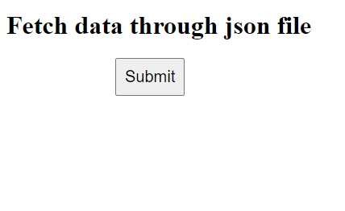
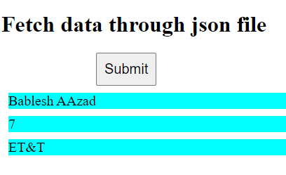

# Fetch-API-using-JSON-File

There are simple to using javascript get to a json file's data on click of button
 
https://bableshaazad.github.io/Fetch-API-using-JSON/

# 1. Before click

  

# 2. After click

  

