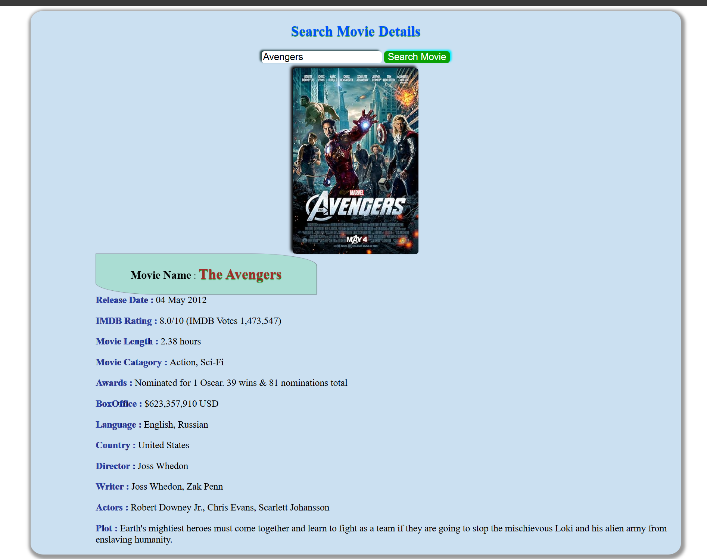
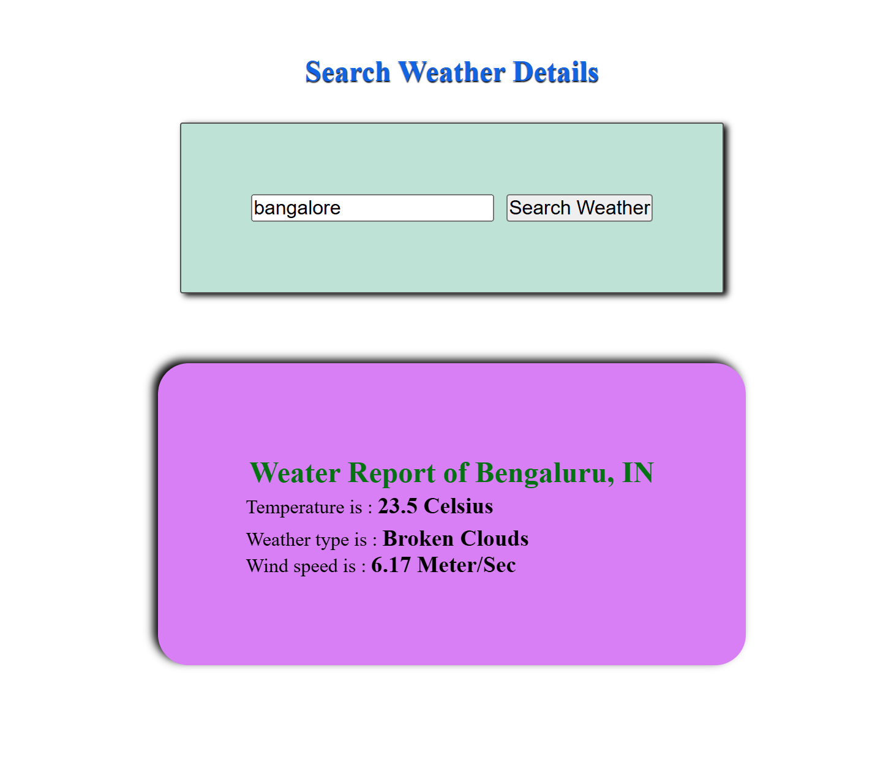
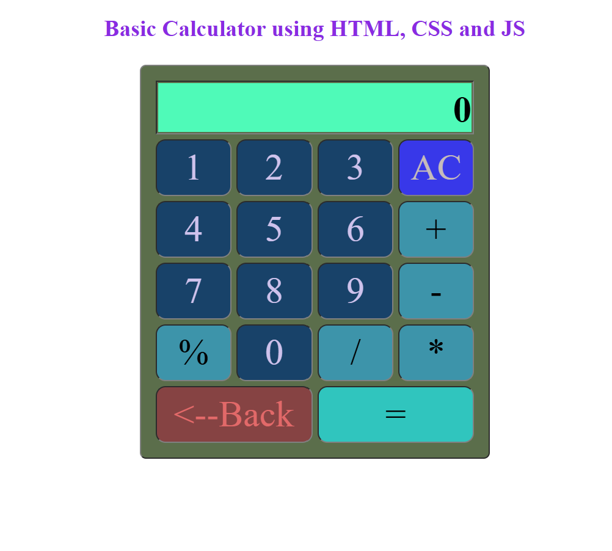
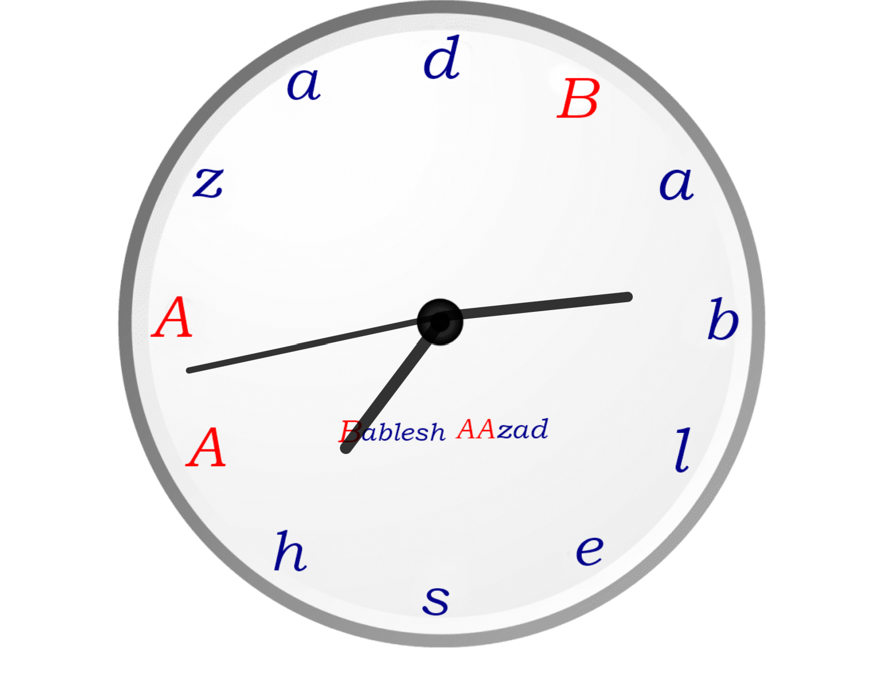
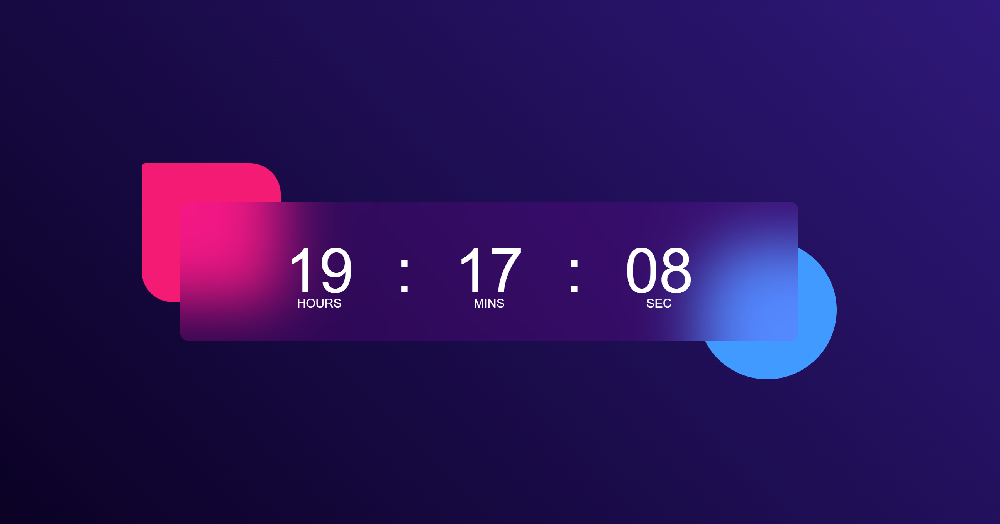
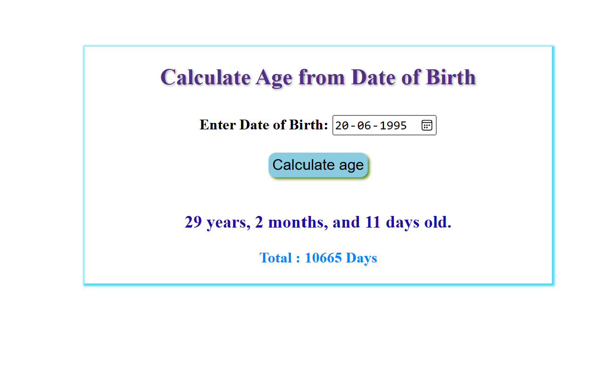

## 🚗👨‍🎓🏠 Small Mini Projects [BableshAAzad.com](https://www.bableshaazad.com)

Here, I have listed numerous mini projects developed using various programming languages and technologies, including `Java`, `Hibernate`, `JDBC`, `Spring Boot`, `JavaScript`, `CSS`, and more.

---

**🏠 Features:**
- Each project comes with specific details. If you want to view a particular project separately, select the corresponding branch.

---

**🧑‍💻 Technologies Used:**

`Java` `JDBC` `Hibernate` `Spring Boot` `Spring MVC` `Spring IOC` `Servlet` `JavaScript` `HTML` `CSS`

---

**💻 How to Use the Source Code:🧑‍💻**

You can download the specific branch's code and use it directly, based on the language or framework.

---

#### 📝 Examples of Some Project UIs 🔍

>- 🔍🧑‍💻 Movie Details Search

  

>- 😶‍🌫️⛅ Weather Report 

  

>- 🧮📝 Basic Calculator

  

>- 🕒⌚ Analog Clock

  

>- ⏰⏲️ Digital Watch

  

>- 🙆 Age Calculator 👴🧓

  

